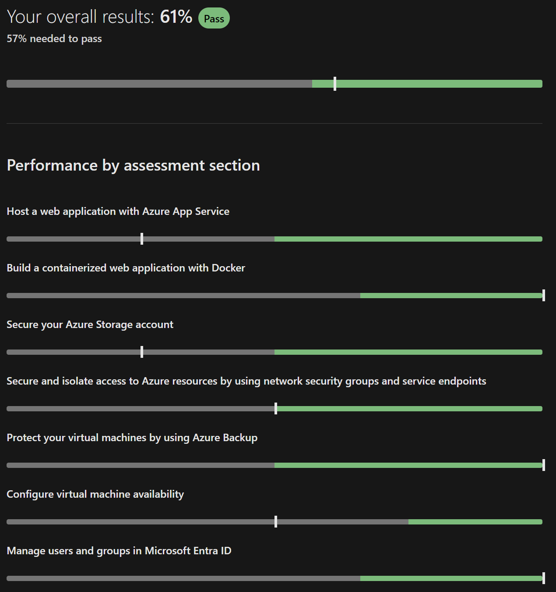

# Azure 104 renewal assessment 38 questions

#### Question 1 of 26
You plan to deploy the following Azure web apps:
- WebApp1, that uses the .NET 6 runtime stack
- WebApp2, that uses the ASP.NET V4.8 runtime stack
- WebApp3, that uses the Java 17 runtime stack
- WebApp4, that uses the PHP 8.0 runtime stack
You need to create the app service plans for the web apps.

What is the minimum number of app service plans that should be created?

Select only one answer.
1. 1
1. 2 `I chose (bard)` `Correct answer`✅
1. 3
1. 4 `(chatGpt, bing)`

#### Question 2 of 26
You plan to deploy an Azure web app that will have the following settings:
- Name: WebApp1
- Publish: Docker Container
- Operating system: Windows
- Region: West US
- Windows Plan (West US): ASP-RG1-8bcf
You need to ensure that WebApp1 uses the ASP.NET V4.8 runtime stack.

Which setting should you modify?

Select only one answer.
1. Operating system
1. Publish `I chose (chatGpt, bard, bing)` `Probably correct answer`
1. Region
1. Windows Plan

#### Question 3 of 26
You plan to deploy an Azure web app that will have the following settings:
- Name: WebApp1
- Publish: Code
- Runtime stack: Java 11
- Operating system: Linux
- Continuous deployment: Disable
You need to ensure that you can integrate WebApp1 with GitHub Actions.

Which setting should you modify?

Select only one answer.
1. Continuous deployment `(chatGpt, bard, bing)` `Probably correct answer`
1. Operating system
1. Publish `I chose`
1. Runtime stack

#### Question 4 of 26
You have Azure web app named WebApp1.

You need to integrate GitHub as a source code repository for WebApp1.

What should you use?

Select only one answer.
1. Deployment Center `I chose (chatGpt, bard)` `Probably correct answer`
1. Deployment slots
1. Extensions
1. Service Connector

#### Question 5 of 26
You plan to create an Azure container instance named container1 that will use a Docker image named Image1.

You need to ensure that container1 has persistent storage.

Which Azure resources should you deploy for the persistent storage?

Select only one answer.
1. an Azure container registry
1. an Azure SQL database
1. an Azure Storage account and a blob container `I chose`
1. an Azure Storage account and a file share `(chatGpt, bard, bing)` `Probably correct answer`

#### Question 6 of 26
You have an Azure container registry that stores an image named Image1 and a Windows Server 2022 Azure virtual machine named VM1.

You need to ensure that you can run Image1 in VM1.

What should you install in VM1?

Select only one answer.
1. Azure Portal
1. Docker `I chose (chatGpt, bard, bing)` `Probably correct answer`
1. Hyper-V role
1. .NET Framework 4.7

#### Question 7 of 26
You have Azure subscription that includes virtual network named VNet1 in West US region.

You plan to deploy following container instances:
- Instance1, running Windows container image in West US region
- Instance2, running Linux container image in West US region
- Instance3, running Windows container image in East US region

Which container instances can be deployed to VNet1?

Select only one answer.
1. Instance1 and Instance2 only `I chose (bard)`
1. Instance1 and Instance3 only
1. Instance1, Instance2 and Instance3 `(chatGpt)`
1. Instance1 only
1. Instance2 only `(bing)` `Probably correct answer`
[answer link](https://stackoverflow.com/questions/65195607/windows-container-in-azure-and-network)

#### Question 8 of 26
You have an Azure Storage account named storage1.

You create the following encryption scopes for storage1:
- Scope1 that has an encryption type of Microsoft-managed keys
- Scope2 that has an encryption type of Customer-managed keys

Which storage services can be used with Scope2?

Select only one answer.
1. blob and file only `I chose (chatGpt, bard)` `Probably correct answer`
1. blob, file, table, and queue
1. blob only
1. file only
1. table and queue only

#### Question 9 of 26
You have an Azure Storage account named storage1 that is configured to use the Hot access tier.

Storage1 has a container named container1 and the lifecycle management rule with following settings:
- Move blob to cool storage: Selected
- Days after last modification: 3
- Move blob to archive storage: Selected
- Days after last modification: 5
On December 1, you create a file named File1 in container1.
On December 10, you rehydrate File1 and move the file to the Hot access tier.

When will File1 be moved to archive storage?

Select only one answer.
1. on December 15 `(chatGpt, bard, bing)` `Probably correct answer`
1. on December 18 `I chose`
1. on January 1
1. within 24 hours

#### Question 10 of 26
You have an Azure subscription that contains the following storage accounts:
- storage1, configured as StorageV2 kind
- storage2, configured as BlobStorage kind
- storage3, configured as FileStorage kind

Which storage account or storage accounts can you use Lifecycle management?

Select only one answer.
1. storage1 and storage2 only `I chose (chatGpt, bard)` `Probably correct answer`
1. storage1 and storage3 only
1. storage1 only
1. Storage1, storage2 and storage3
1. storage2 and storage3 only

#### Question 11 of 26
You have an Azure storage account that contains a blob container named container1.

You need to configure access to container1.

Which authorization types can you use?

Select only one answer.
1. Microsoft Entra ID only
1. Microsoft Entra ID, shared access signature or certificate only
1. Microsoft Entra ID, storage key or shared access signature only
1. Microsoft Entra ID, storage key, shared access signature or certificate `I chose (chatGpt, bard)` `Probably correct answer`
1. Storage key or shared access signature only

#### Question 12 of 26
You have an Azure subscription that contains a storage account named storage1 and the following virtual machines:
- VM1 has a public IP address of 13.68.158.24 and is connected to VNET1/Subnet1
- VM2 has a public IP address of 52.255.145.76 and is connected to VNET1/Subnet1
- VM3 has a public IP address of 13.68.158.50 and is connected to VNET1/Subnet2

The subnets have the following service endpoints:
- Subnet1 has a Microsoft.Storage service endpoint
- Subnet2 does NOT have any service endpoint
- Storage1 has a firewall configured to allow access from the 13.68.158.0/24 IP address range only.

Which virtual machines can access storage1.

Select only one answer.
1. VM1 and VM2 only `(bing)`
1. VM1 and VM3 only `I chose (chatGpt)`
1. VM1 only `(bard)` `Probably correct answer`
1. VM1, VM2, and VM3
1. VM3 only

#### Question 13 of 26
You have an Azure subscription that includes the following resources:
- VNet1, a virtual network
- Subnet1, a subnet in VNet1
- WebApp1, a web app application service
- NSG1, a network security group
You create an application security group named ASG1.

Which resource can use ASG1?

Select only one answer.
1. NSG1 `I chose (chatGpt, bing)` `Probably correct answer`
1. Subnet1
1. VNet1
1. WebApp1 `(bard)`

#### Question 14 of 26
You have an Azure subscription that contains the following fully peered virtual networks:
- VNet1, located in the West US region. 5 virtual machines are connected to VNet1.
- VNet2, located in the West US region. 7 virtual machines are connected to VNet2.
- VNet3, located in the East US region, 10 virtual machines are connected to VNet3.
- VNet4, located in the East US region, 4 virtual machines are connected to VNet4.
You plan to protect all of the connected virtual machines by using Azure Bastion.

What is the minimum number of Azure Bastion hosts that you must deploy?

Select only one answer.
1. 1
1. 2 `(bing)` `Probably correct answer`
1. 3 `(bard)`
1. 4 `(chatGpt)`
[answer link](https://github.com/MicrosoftDocs/azure-docs/blob/main/articles/bastion/vnet-peering.md)

#### Question 15 of 26
You have an Azure virtual network named VNET1 that is connected to a network security group (NSG) named NSG1. NSG1 has the following inbound security rules:
- Rule1 has a priority of 100 and allows port 3389 on TCP protocol from any source and to any destination
- Rule2 has a priority of 200 and allows ports 80 and 8080 on UDP protocol from any source and to any destination
- Rule3 has a priority of 300 and denies ports 1-2000 on TCP protocol from any source and to any destination
- Rule4 has a priority of 400 and allows ports 50-500 on TCP protocol from VirtualNetwork source and to any destination
- Rule5 has a priority of 500 and allows ports 80 and 443 on TCP protocol from any source and to any destination
You need to allow http and https connections from the internet to VNET1.

What should you change for NSG1?

Select only one answer.
1. Priority for Rule3 to 450
1. Priority for Rule4 to 250
1. Priority for Rule5 to 250 `I chose (chatGpt, bard)` `Probably correct answer`
1. Protocol for Rule2 to TCP

#### Question 16 of 26
You have a Recovery Services vault named Vault1 that has soft delete enabled.
Vault1 stores backups for the following Azure resources:
- an Azure virtual machine named VM1
- an Azure file share named share1
- a SQL Server on Azure virtual machine named SQL1

Which backups are protected by soft delete?

Select only one answer.
1. share1 only
1. VM1 and SQL1 only `I chose (chatGpt, bing)` `Probably correct answer`
1. VM1 only
1. VM1, share1, and SQL1 `(bard)`

#### Question 17 of 26
You have a Windows Server Azure virtual machine named VM1.

You need to back up two folders in VM1 by using Azure Backup. The solution should minimize administrative effort.

What should you deploy first?

Select only one answer.
1. Azure Backup Server `I chose`
1. Recovery Services agent `(bard, bing)` `Probably correct answer`
1. Microsoft Monitoring agent `(chatGpt)`
1. Windows Server Backup role

#### Question 18 of 26
You have an Azure virtual machine named Computer5 and a Recovery Services vault named Vault5. Computer5 contains the following data disks:
- DiskA has a size of 512 GB
- DiskB has a size of 30 TB
- DiskC has a size of 26 TB
- DiskD has a size of 2.0 TB

Which data disks can you back up to Vault5?

Select only one answer.
1. DiskA, DiskB, DiskC, and DiskD `I chose (chatGpt, bing)` `Probably correct answer`
1. DiskA only `(bard)`
1. DiskB only
1. DiskC only
1. DiskD only

#### Question 19 of 26
You recently create an Azure virtual machine standard backup policy.

You need to configure a retention period for virtual machine instant recovery snapshots.

What is the maximum number of days that can be set for the retention period?

Select only one answer.
1. 5 `I chose (bing)` `Probably correct answer`
1. 7 `(chatGpt)`
1. 14
1. 30 `(bard)`

#### Question 20 of 26
You have an Azure subscription.

You plan to run a data warehouse in an Azure virtual machine named VM1.
You need to ensure that VM1 is optimized for running a data warehouse.

Which VM type should you use for VM1?

Select only one answer.
1. Compute optimized (F-Series)
1. General purpose (D-Series)
1. High performance computing (H-Series)
1. Memory optimized (M-Series) `I chose (chatGpt, bard, bing)` `Probably correct answer`
1. Storage optimized (Ls-Series)

#### Question 21 of 26
You have an Azure subscription that contains the following resources:
- A resource group named RG1 in the West US region
- A resource group named RG2 in the Central US region
- A virtual network named VNet1 that is deployed to the West US region in RG1
- A virtual network named VNet2 that is deployed to the Central US region in RG1
- A virtual network named VNet3 that is deployed to the West US region in RG2
You need to deploy a virtual machine named VM1 to RG1 in the West US region.

To which virtual network or virtual networks can you connect VM1?

Select only one answer.
1. VNet1 only `I chose (chatGpt, bard)` `Probably correct answer`
1. VNet1 or VNet2 only
1. VNet1 or VNet3 only
1. VNet1, VNet2 or VNet3

#### Question 22 of 26
You have an Azure virtual machine named VM1.

VM1 contains the following:
- a File named File1 that is stored on volume C:\
- a File named File2 that is stored on volume D:\
- an App named App1 that is in a running state
- a user named User1 that is connected to VM1
You plan to resize VM1.

What is preserved after the resize?

Select only one answer.
1. File1 and File2 only
1. File1 and the state of App1 only `I chose (chatGpt, bard)` `Probably correct answer`
1. File1, File2 and the state of App1 only
1. File1, File2, the state of App1 and the connection of User1
1. File1 only

#### Question 23 of 26
You have an Azure subscription and an availability set named AS1 that has 5 update domains.

You deploy 27 virtual machines to AS1.

After a planned update, what is the minimum number of virtual machines that are available?

Select only one answer.
1. 14
1. 20
1. 21
1. 22 `I chose (bard, bing)` `Probably correct answer`
1. 26 `(chatGpt)`

#### Question 24 of 26
You have a Microsoft Entra tenant named contoso.com that contains a user named Ben Smith.

You configure a Password protection for contoso.com that includes the following Custom banned passwords settings:
- Enforce custom list: Yes
- Custom banned password list: Contoso
- Which password can be used by Ben Smith?

Select only one answer.
1. C0nt0s0123 `(bard)`
1. CONTOSO123
1. Conto123so `I chose`
1. FgRs01 `(chatGpt, bing)` `Probably correct answer`

#### Question 25 of 26
You have a Microsoft Entra tenant.

You create a user named Admin1.
You need to ensure that Admin1 can perform following tasks:
- Assign licenses to Microsoft Entra groups
- Reset passwords of Microsoft Entra users

What Microsoft Entra role should you add to Admin1?

Select only one answer.
1. Billing Administrator
1. Helpdesk Administrator `(bard)`
1. License Administrator `I chose (chatGpt)`
1. User Administrator `(bing)` `Probably correct answer`

#### Question 26 of 26
You have an Azure subscription that contains a user named User1, a resource group named RG1, and a virtual machine named VM1.

You enable a system-assigned managed identity for VM1.

To which identities can you assign the Reports Reader role?

Select only one answer.
1. User1 and RG1 only
1. User1 and VM1 only `I chose (chatGpt, bing)` `Probably correct answer`
1. User1 only
1. User1, RG1, and VM1 `(bard)`

#### Question 1 of 26
You have an Azure web app named Contoso2023.

You add a deployment slot to Contoso2023 named Slot1.
You need to be able to perform a deployment slot swap with preview.

What should you modify?

Select only one answer.
1. application settings for Contoso2023
1. application settings for Contoso2023-Slot1 `I chose (bing)`
1. general settings for Contoso2023
1. general settings for Contoso2023-Slot1

#### Question 3 of 26
You have an Azure subscription that includes a virtual network named VNet1.

You plan to create a web app named WebApp1 and deploy it to VNet1.
You need to prepare the environment for the planned web app. The solution must minimize costs.

Which app service plan size should you use?

Select only one answer.
1. Dev / Test B1 `I chose (bing)`
1. Dev / Test F1
1. Isolated I1V2
1. Production P1V2
1. Production P3V3

#### Question 4 of 26
You have an Azure subscription that includes the following web apps:
- WebApp1, which runs code in a Windows operating system.
- WebApp2, which runs code in a Linux operating system.
- WebApp3, which runs in a Docker container on Windows.
- WebApp4, which runs in a Docker container on Linux.

From which web apps can you use WebJobs?

Select only one answer.
1. WebApp1 and WebApp2 only
1. WebApp1 and Web3 only `I chose (bing)`
1. WebApp1 only
1. WebApp1, WebApp2, WebApp3 and WebApp4

#### Question 5 of 26
You have an Azure container registry named Registry1.

You create a container image named image1 on a Windows Server container host named Host1.
You need to store image1 in Registry1.

Which URL should you use to push image1 from Host1?

Select only one answer.
1. azure.microsoft.com/Registry1
1. Registry1.azurecr.io `I chose (bing)`
1. Registry1.file.core.windows.net
1. Registry1.onmicrosoft.com

#### Question 12 of 26
You have an Azure subscription that contains a virtual network named VNET1. VNET1 uses the following address spaces:
- 10.10.1.0/24
- 10.10.2.0/28

VNET1 contains the following subnets:
- Subnet1- has an address space of 10.10.1.0/24
- Subnet2- has an address space of 10.10.2.0/28
To Subnet1, you deploy a virtual machine named VM1 that runs Windows Server 2022. VM1 has Remote Desktop enabled.
VM1 does NOT have a public IP address.
You need to be able to deploy Azure Bastion to protect VM1.

What should you do first?

Select only one answer.
1. Add a new subnet to VNET1. `I chose (bing)`
1. Add a public IP address to VM1.
1. Add an extension to VM1.
1. Modify the address space of VNET1.

#### Question 14 of 26
You have an Azure subscription that contains a virtual machine named VM1 and a storage account named storage1.

You need to ensure that VM1 can access storage1 by using the Azure backbone.

What should you configure?

Select only one answer.
1. a routing table
1. a service endpoint `I chose (bing)`
1. a VPN gateway
1. Peering

#### Question 15 of 26
You have an Azure subscription that includes following resources:
- VNet1, a virtual network
- Subnet1, a subnet in VNet1
- VM1, a virtual machine
- NIC1, a network interface of VM1
- LB1, a load balancer
You create a network security group named NSG1.

To which two Azure resources can you associate NSG1?

Select all answers that apply.
1. LB1
1. NIC1 `I chose (bing)`
1. Subnet1 `I chose (bing)`
1. VM1
1. VNet1

#### Question 16 of 26
You have an Azure subscription that contains the following virtual machines:
- VM1, a virtual machine that runs Windows Server 2019
- VM2, a virtual machine that runs Red Hat Enterprise Linux
- VM3, a virtual machine that is configure with Azure Disk encryption and runs Windows Server 2022
You use Azure Backup to back up the three virtual machines.

Which virtual machine or virtual machines can use file-level restore?

Select only one answer.
1. VM1 and VM2 only `I chose (bing)`
1. VM1 and VM3 only
1. VM1 only
1. VM1, VM2 and VM3

#### Question 19 of 26
You have an Azure subscription that includes a virtual machine named VM1.

You need to protect VM1 by using Azure Backup.

Which Azure resource should you create first?

Select only one answer.
1. a backup policy
1. a backup vault
1. a recovery services vault `I chose (bing)`
1. a storage account

#### Question 20 of 26
You have an Azure subscription.

You plan to use fault domains.

From which Azure resource can you configure the fault domains?

Select only one answer.
1. Availability set `I chose (bing)`
1. Virtual machine
1. Virtual machine scale set `(bing)`
1. Virtual network

#### Question 23 of 26
You have an Azure subscription named Sub1.

You plan to deploy a virtual machine scale set named VMSS1 in East US region. VMSS1 will have 8 instances.

What is the maximum number of availability zones that VMSS1 can use?

Select only one answer.
1. 1
1. 2
1. 3 `I chose (bing)`
1. 4

#### Question 25 of 26
Your company has multiple departments and one Azure subscription. The user accounts for all employees are in the same Microsoft Entra tenant.

You need to delegate permissions for the users in a single department only.

What should you use to organize the user accounts?

Select only one answer.
1. administrative unit `I chose (bing)`
1. security group
1. resource group
1. workspace

